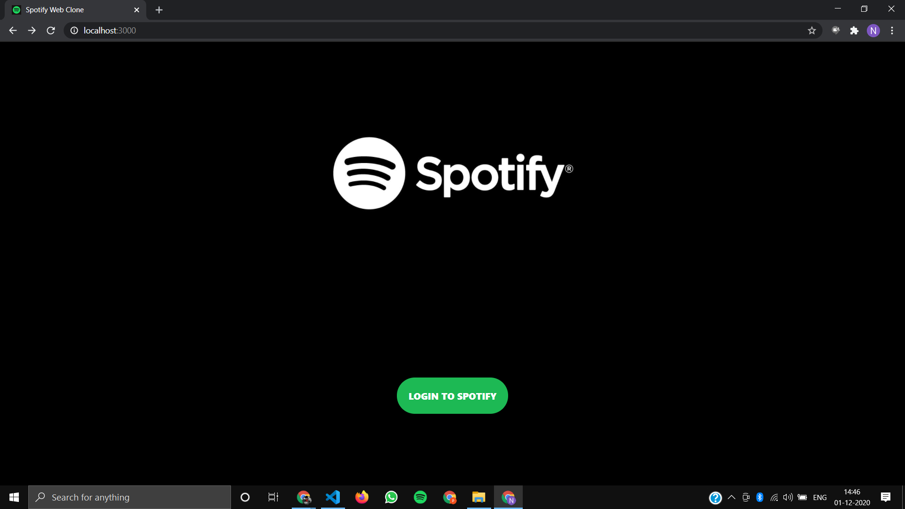
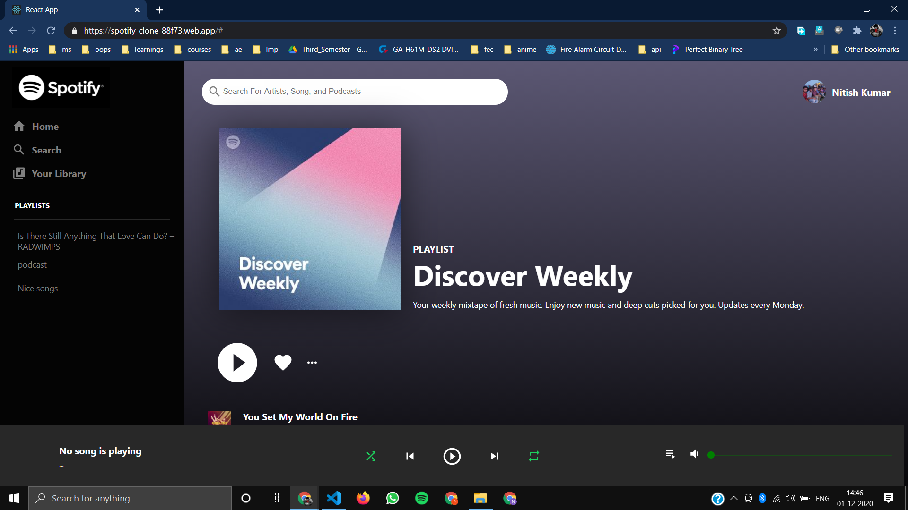
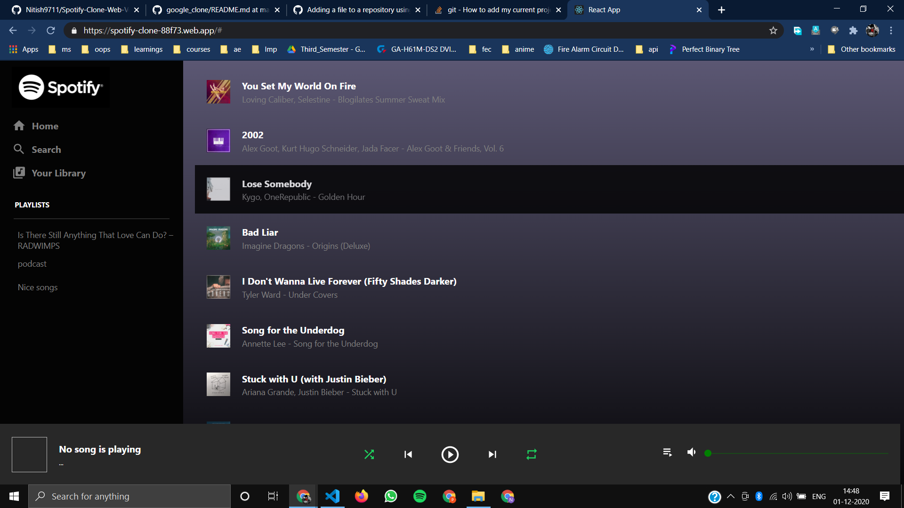

# Spotify Web Clone

This project is an Spotify web clone made with React js and Spotify Developers API.

## You can visit this project on
[https://spotify-clone-88f73.web.app/](https://spotify-clone-88f73.web.app/)


## How to Run 
1. Clone this Repo to your Local Machine.
2. Type ``` npm install ```.
3. Type ```npm start``` to run the server.
4. Open [localhost:3000](localhost:3000/) in your browser.

## ScreenShot


</br>
</br>


</br>
</br>


</br>
</br>


# Spotify-Clone-Web-Version
